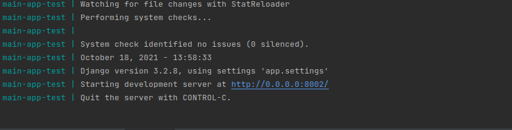

# Configuração

1. Primeiro, faça a instalação do Python e Docker compose
   1. Link para instalação compose [Docker Compose](https://docs.docker.com/compose/install/)
2. Em seguida, rode o comando 
    ``` 
    docker-compose up
    ```
3. Depois de rodar o comando deve aparecer a seguinte tela 
se deseja alterar a porta de inicialização altere os seguintes comandos no **docker-compose.yml**
```
command: bash -c "python manage.py makemigrations && python manage.py migrate && python manage.py runserver 0.0.0.0:8002"
ports:
    - "8002:8002"
```
4. Por fim, acesse o link do projeto para fazer os testes
5. Possíveis problemas
   1. Erro de permissão quando rodar o **docker-compose up** rodar o seguinte comando na pasta raiz do projeto sudo chown -R $USER:$USER .
6. Se precisar acessar o banco de dados externo a aplicação precisará rodar o seguinte comando
   1. ``` 
      docker inspect -f '{{range .NetworkSettings.Networks}}{{.IPAddress}}{{end}}' postgres-db-test
      ```
   Ira mostrar o ip da aplicação postgres rodando em docker, basta pegar o IP e acessar em algum programa de gerenciamento de banco de dados   
    
# Descrição do projeto

Projeto para importação do arquivo CNAB de acordo com a documentação solicitada, projeto utilizando
as seguintes tecnologias
- [Python Django](https://www.djangoproject.com/)
- [Django Rest Framework](https://www.django-rest-framework.org/)
- [Docker Compose](https://docs.docker.com/compose/)
- [Postgres SQL](https://www.postgresql.org/)

**A aplicação web tem:**

1. Uma tela utilizando os templates do Django para importação do arquivo
2. Listagem das informações importados para o banco de dados com agrupamento das lojas e tipos
3. Banco de dados Postgres utilizando o Django ORM para gerar as tabelas necessárias
4. Docker compose para rodar a aplicação de uma forma mais simples
5. API utilizando restFull para fazer a conexão com os templates
6. Templates feitos em HTML e CSS puro
